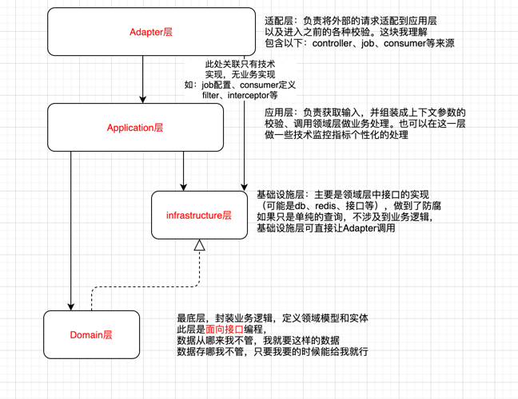

[TOC] 目录结构

### 定义
请求入参：执行以 Command 结尾，查询以Query结尾
数据模型：DO 结尾
领域实体：Entity
数据传输对象：DTO结尾（返回数据）
### 规定
#### 返回码
- 0 表示处理异常
- 1 表示业务处理成功
- 1000~1999 属于公共返回
  - 1008 token无效
- 2000~2999 属于领域返回
- 3000~3999 属于应用层返回
- 4000~4999 属于适配层返回
- 5000~5999 属于基础设施层返回

#### ddd-common 是ddd模式下的公共包
包含：
- annotation 公共注解
- constant  公共常量
- entity  公共"数据"实体定义
  - common  通用实体，比如LoginToken,全局使用
  - event 事件模板方法
  - dto 页面交互统一返回对象（数据data都是DTO）
- exception 通用异常封装

#### ddd-demo 

#####  adapter 适配器层
负责将外部请求，适配到应用层；
token校验和鉴权也在这一层统一通过切面处理
可以是适配api，也可以是从job或者consumer消费中适配
**包结构说明：**
- api.controller 存放业务api,有需要按模块拆分
- api.command  存放入参, 和controller对应，有需要按模块拆分，执行以 Command 结尾，查询以Query结尾
- api.resp 如需要适配返回值，在此处理，如果不需要，直接使用应用层的返回
- consumer 消费者入口，以及适配应用层标准接口
- job  定时入口，以及适配应用层标准接口
##### application 应用层
负责获取输入，并组装成上下文参数的校验、调用领域层做业务处理；
- executor 应用执行层
  - 根据实际情况组织领域服务需要的资源；
  - 不要有太多的业务属性
  - 调用领域，以及非业务功能的处理
  - 应用层执行，以executor结尾，这个可以和框架相关
  - 如果只是内部调用，可以加事务
  - 如果有远程调用，不能加事务
- dto 需要在领域层返回的基础上包一层时需要
- convert 转换器，主要处理由application到domain 包含：上下文构建，领域服务的构建
##### domain 领域层
业务逻辑封装，和技术框架、数据库表结构没有任何关系，
此层是**面向接口编程**
数据从哪来我不管，我就要这样的数据
数据存哪我不管，只要我要的时候给我就行
- constant 领域服务的常量
- dto
  - context 领域上下文
  - event 领域事件
  - resp  领域返回数据
- event 事件（领域事件）
- gateway 领域操作资源网关（领域内的接口定义）
- model 领域实体的定义，按业务模块划分
- service 领域服务的定义，复杂业务处理，面向接口编程
  - 如果有事务，根据事务的大小以及有无rpc调用拆到gateway的实现或者application层
  - 不建议使用分布式事务，保证业务的最终一致性即可
##### infrastructure 基础设施层
负责：领域层接口的实现，公共代码的封装（统一鉴权等）
数据的插叙，如果只是单纯的查询，不涉及到业务逻辑，可以直接让Adapter调用
- common 公共的
  - annotation 项目里的自定义注解
  - aspect 项目里用的切面
  - configuration 配置
  - constant 常量
  - filter  过滤器
  - util  工具类
  - plugin  插件
  - property 属性值
- convert 转换器，主要处理，网关实现到领域的转化
- dto  数据实体，包含
- event 系统事件
- gatewayimpl（技术实现）
  - database gateway的数据库实现
  - rpc gateway的远程调用实现（需要转成模型才能往domain里传）
  - composite gateway的组合实现
- persistence 持久层
  - entity  持久层实体  以DO结尾
  - mapper 数据库操作接口
- rpc 远程调用原子服务
  - external  外部调用
    - dto 调用出参
    - vo 调用入参
  - internal  内部调用(用同一个eureka)
    - dto 调用出参
    - vo 调用入参
- service 内部公共服务封装

#### context的作用以及放的位置？
- context应该只作用域application层
- context对应的是当前application的上下文
- 在application里会根据不同的领域模型拆解到对应的聚合根上，或领域实体上；
- 一个context可能对应多个接口，但是一定对应一一种场景 
#### 聚合根、实体、值对象的关系（拆解每个人一个理解，还没想好怎么标准化操作）
- 聚合根是根据业务走，用例图能很好的表达，我们操作的领域
- 值对象，一组字段组合起来能标识出一块内容的，比如会有的有效期，几个字段组合起来就能体现会员是否有效，有效期脱离了会员又没有意义；
- 聚合根不能引用聚合根
- 实体或值对象能出现在多个聚合根里

#### 如何理解领域？
- 领域逻辑是显性的专业知识，符合事实逻辑（生活中的事务，必须满足一致性），可以很容易的推导出来；
- 领域逻辑是提纯、通用的规则，不管我们的业务流程怎么变，我们的领域逻辑是不变的，所以领域一定是正确的，一定是合规的（合理性不由领域控制）；
- 领域逻辑是稳定的（不易变，易变的规则都应该放到应用层）
##### 就像我们做的会员系统，用户在购买会员的时候
- 参数校验 application层
- 防重校验 application层
- 有支付中的会员订单不能购买（随着业务的变动，易变）application层
- 会员不能重复购买（随着业务的变动，易变）application层
- 库存扣减与初始化订单 （不变）领域层
- 支付（支付领域）领域层
- 会员初始化 （不变）领域层
### 已提供的
#### 功能
- 全局异常处理 GlobalExceptionHandler
- 必须登录（@RequiredToken）或者必须实名（@RequiredRealName）注解  RequestParamsRequiredAspect
- loginInfo解析并填入本地线程  RequestTokenConvertAspect
- apollo接入  infrastructure.configuration.apollo
- druid数据源  infrastructure.configuration.druid
- feign 处理  infrastructure.configuration.feign
- kafka 处理 将业务kafka和日志kafka分离 infrastructure.configuration.kafka
- mybatis 多数据源处理需要结合druid 
- redis缓存扩展
- sleuth 对接
- swagger 对接
- cors处理
- 数据库分表注解 @TableSeg
#### 工具
- CodeGeneratorTest  代码生成工具
- ResultBeanUtil 对返回结果进行了封装
- LoginTokenUtil 从本地线程拿LoginInfo信息
- IdWorker 分布式id生成器（单机内存有序）
- CacheUtils 尽量用注解，注解处理不了，使用这个
- JsonUtils  json工具类，使用jackson
- SignUtil  加签工具类

