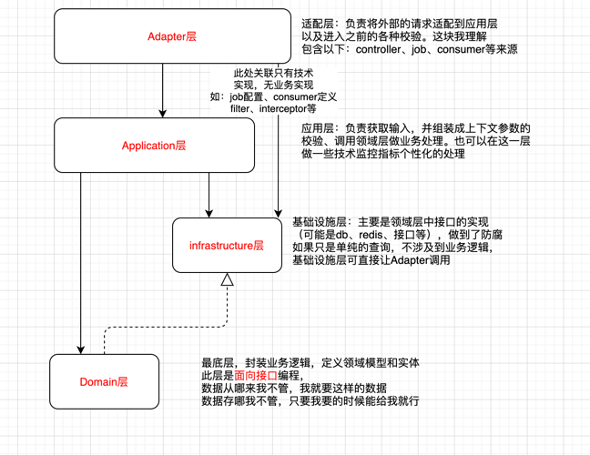

### 定义
- 请求入参：执行以 Command 结尾，查询以Query结尾
- 数据模型：DO 结尾
- 领域实体：Entity
- 数据传输对象：DTO结尾（返回数据）

### 目录结构

#### ddd-common 是ddd模式下的公共包
包含：
- annotation 公共注解
- constant  公共常量
- entity  公共"数据"实体定义
    - common  通用实体，比如LoginToken,全局使用
    - event 事件模板方法
    - dto 页面交互统一返回对象（数据data都是DTO）
- exception 通用异常封装

#### demo说明 

#####  adapter 适配器层
负责将外部请求，适配到应用层；
token校验和鉴权也在这一层统一通过切面处理
可以是适配api，也可以是从job或者consumer消费中适配
**包结构说明：**
- api.controller 存放业务api,有需要按模块拆分
- api.command  存放入参, 和controller对应，有需要按模块拆分，执行以 Command 结尾，查询以Query结尾
- api.resp 如需要适配返回值，在此处理，如果不需要，直接使用应用层的返回
- consumer 消费者入口，以及适配应用层标准接口
- job  定时入口，以及适配应用层标准接口
##### application 应用层
负责获取输入，并组装成上下文参数的校验、调用领域层做业务处理；
- executor 获取入参，组织上下问来源数，调用领域，以及非业务功能的处理
  应用层执行，以executor结尾，这个可以和框架相关
- convert 转换器，主要处理由application到domain 包含：上下文构建，领域服务的构建
##### domain 领域层
业务逻辑封装，和技术框架、数据库表结构没有任何关系，
此层是**面向接口编程**
数据从哪来我不管，我就要这样的数据
数据存哪我不管，只要我要的时候给我就行
- constant 领域服务的常量
- dto
   - context 领域上下文
   - event 领域事件
   - resp  领域返回数据
- gateway 领域操作资源网关（领域内的接口定义）
- model 领域实体的定义，按业务模块划分
- service 领域服务的定义，复杂业务处理，面向接口编程，如果有事务，需要将事务定义到gateway
##### infrastructure 基础设施层
负责：领域层接口的实现，公共代码的封装（统一鉴权等）
数据的插叙，如果只是单纯的查询，不涉及到业务逻辑，可以直接让Adapter调用
- common 公共的
  - aspect 项目里用的切面
  - configuration 配置
  - constant 常量
  - filter  过滤器
  - util  工具类
  - plugin  插件
- convert 转换器，主要处理，网关实现到领域的转化
- gatewayimpl
  - database 数据库实现
  - rpc 远程调用实现
  其他复杂操作
- persistence 持久层
   - entity  持久层实体  以DO结尾
   - mapper 数据库操作接口
  

